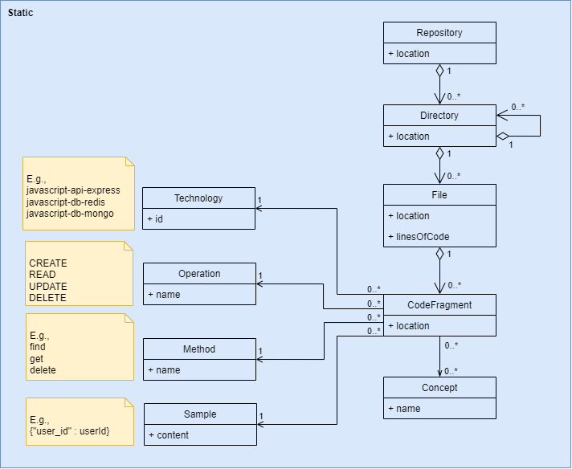

# DENIM Reverse Engineering

[](https://gitlab.unamur.be/reverse-engineering/web/-/commits/master)

## 📣 Description

This application enables to reverse-engineer a microservices architecture from a data perspective.

## 📝 How to cite?

```latex

%%% Cite the paper

@inproceedings{andre2025a,
  title         = {Data Access-centered Understanding of Microservices Architectures},
  author        = {Andr{\'e}, Maxime and Rivière, Etienne and Cleve, Anthony},
  booktitle     = {Proceedings of the 22nd International Conference on Software Architecture (ICSA 2025): NEMI Track},
  year          = {2025},
  organization  = {IEEE Computer Society Press},
  doi           = {https://doi.org/10.1109/icsa-c65153.2025.00007}
}
```

## ⭐ Features

Here is a summary of the features currently supported.

### Static Analysis by AST

#### Description

The static analysis by AST feature enables the developer to (1) retrieve one or more GitHub/GitLab microservices, (2)
statically analyze them through an AST, (3) identify, through heuristics, data access code fragments linked to certain 
API or database technologies and likely to change during the evolution phase, implying then the propagation of 
changes in components (e.g. other microservices or databases), (4) extract thanks to NLP the data concepts of those 
data access code fragments, (5) link the data access code fragments with related data concepts, (6) compare data 
concepts with other ones in the same microservice, (7) associate same data concepts, (8) present the result as a 
report, in a defined model, designed to help developers understand microservices in a conceptual data approach, so 
that they can pay attention to them when co-evolving API and database accesses. This report aims to provide 
developers with a valuable basis for software evolution tasks, such as re-documentation, visualization, quality 
assessment, improvement recommendations, impact analysis, or change propagation.  This analysis is slower compared 
to the static analysis by NLP/TR, but it retrieves more information.

Here is a summary of languages and technologies currently supported:

#### Implementation status

| Language              | Technology                        | Implementation status |
| --------------------- | --------------------------------- | --------------------- |
| JavaScript/TypeScript | MongoDB <br/> Redis <br/> Express | 🌕 <br/> 🌕 <br/> 🌕  |

#### How to?

**INPUT**

Invoke the static analysis by using the [POST /static/ast](http://locahost:3000/static/ast)
root with a ZIP file inside the request as a form-data with the key `file` and the ZIP file as value, and not as a 
binary file. This zip file can be generated from GitHub/GitLab repositories thanks to [DENIM Downloading](https://github.com/DatabaseEvolutionNudgeInMicroservices/downloading).
Options, such as the language of the analysis, must be given in the options field with the key `options` as follows:

```json
{
  "language": "<language>" // The language of the analysis
}
```

⚠️ This can take a while (a few minutes) depending on the repository size.
⚠️ All repositories to analyze have to be integrated in the ZIP file.
⚠️ Each directory at the root of the zip file represents a repository.

Optional hints can be provided through the body to guide the analysis with in/out (i.e., include, exclude) keywords hints (e.g., grammar of a library, list of conceptual schema concepts, etc.). This body should be structured as follows:

```json
{
  "hints": {
    "int": ["<int term 1>", "<int term 2>", "...", "<int term X>"], // Inclusion keywords
    "out": ["<out term 1>", "<out term 2>", "...", "<out term X>"]  // Exclusion keywords
  }
}
```

**OUTPUT**

Consult the response object:

```json
[
  {
    // A repository
    "directories": [
      {
        // A directory
        "location": "https://github.com/<user>/<repository>",
        "directories": [
          // ...
        ],
        "files": [
          {
            // A file
            "location": "https://github.com/<user>/<repository>/.../<file path>.js",
            "linesOfCode": <LoC>,
            "codeFragments": [
              {
                // A code fragment
                "location": "https://github.com/<user>/<repository>/.../<file path>.js#Lx1Cx1-Lx2y2",
                "technology": {
                  "name": "<technology>" // E.g., javascript-api-express-call, javascript-db-mongo-call, javascript-db-redis-call.
                },
                "operation": {
                  "name": "<operation>" // E.g., CREATE, READ, UPDATE, DELETE, OTHER
                },
                "method": {
                  "name": "<method>" // E.g., post, get, findOne, sadd, etc.
                },
                "sample": {
                  "content": "<sample>" // E.g., a Redis key, a MongoDB object, etc.
                },
                "concepts": [
                  {
                    "name": "<concept>" // E.g., a route resource concept name, a Redis key name, a MongoDB, collection name, etc.
                  }
                ],
                "heuristics": "<heuristics>", // The matching heuristics tracing.
                "score": "<score>" // The computed likelihood score.
              }
            ]
          } // ...
        ]
      } // ...
    ]
  } // ...
]
```

NOTE: The response format is the same as the one produced by the static analysis by NLP/TR because it relies on the 
same model.

NOTE: This analysis is slower compared to the static analysis by NLP/TR, but it retrieves more information.

### Static Analysis by NLP/TR

#### Description

The static analysis by NLP/TR (Natural Language Processing and Text Retrieval) feature enables the developer to (1) 
retrieve one or more GitHub/GitLab microservices, (2) browse the entire architecture considering source file as text,
(3) identify data access code fragments linked to certain API or database technologies and likely to change during 
the evolution phase, implying then the propagation of changes in components (e.g. other microservices or databases), 
by performing lexical and statistical analysis to extract candidate code fragments and concepts from source files, 
(4) extract extra data, (5) filter and prioritize code fragments with statistical relevance metrics (e.g., TF-IDF,
dominance, variation) and some hints, (6) compare data concepts with other ones in the same microservice, (7) associate
same data concepts, (8) present the result as a report, in a defined model, designed to help developers understand 
microservices in a conceptual data approach, so that they can pay attention to them when co-evolving API and database
accesses. This report aims to provide developers with a valuable basis for software evolution tasks, such as
re-documentation, visualization, quality assessment, improvement recommendations, impact analysis, or change
propagation. This analysis is faster compared to the AST analysis but it retrieves less information.

Here is a summary of languages and technologies currently supported:

#### Implementation status

| Language              | Technology | Implementation status |
|-----------------------| ---------- | --------------------- |
| JavaScript/TypeScript | Any        | 🌕                    |
| Java                  | Any        | 🌕                    |

#### How to?

**INPUT**

Invoke the static analysis by using the [POST /static/nlptr]
(http://locahost:3000/static/nlptr) root with a ZIP file inside the request as a 
form-data with the key `file` and the ZIP file as value, and not as a binary file. This zip file can be generated 
from GitHub/GitLab repositories thanks to [DENIM Downloading](https://github.com/DatabaseEvolutionNudgeInMicroservices/downloading).
The language is automatically detected.

⚠️ This can take a while depending (a few seconds) on the repository size.
⚠️ All repositories to analyze have to be integrated in the ZIP file.
⚠️ Each directory at the root of the zip file represents a repository.

Optional hints can be provided through the body to guide the analysis with in/out (i.e., include, exclude) keywords hints (e.g., grammar of a library, list of conceptual schema concepts, etc.). This body should be structured as follows:

```json
{
  "hints": {
    "int": ["<int term 1>", "<int term 2>", "...", "<int term X>"], // Inclusion keywords
    "out": ["<out term 1>", "<out term 2>", "...", "<out term X>"]  // Exclusion keywords
  }
}
```

**OUTPUT**

Consult the response object:

```json
[
  {
    // A repository
    "directories": [
      {
        // A directory
        "location": "https://github.com/<user>/<repository>",
        "directories": [
          // ...
        ],
        "files": [
          {
            // A file
            "location": "https://github.com/<user>/<repository>/.../<file path>.js",
            "linesOfCode": <LoC>,
            "codeFragments": [
              {
                // A code fragment
                "location": "https://github.com/<user>/<repository>/.../<file path>.js#Lx1",
                "technology": {
                  "name": "<technology>" // E.g., javascript-any-any-any
                },
                "operation": {
                  "name": "?"
                },
                "method": {
                  "name": "?"
                },
                "sample": {
                  "content": "<sample>" // i.e., the line of code 
                },
                "concepts": [
                  {
                    "name": "<concept>" // E.g., a route resource concept name, a Redis key name, a MongoDB, collection name, etc.
                  }
                ],
                "heuristics": "<heuristics>", // The matching heuristics tracing.
                "score": "<score>" // The computed likelihood score.
              }
            ]
          } // ...
        ]
      } // ...
    ]
  } // ...
]
```

NOTE: This response format is the same as the one produced by the static analysis by AST because it relies on the same 
model.

NOTE: This analysis is faster compared to the static analysis by AST, but it retrieves less information (i.e. see "?").

## 👩‍💻 Development details

### Setup

See [INSTALL file](INSTALL.md).

### Test the app (manually)

Manual test suites are set up thanks through the [Postman](https://www.postman.com/) tool.

The tests are specified in the `/test/manual` directory and are named following the `*.test.js` pattern.

⚠️ Files attached to requests, under the `file` key of the `form-data`, must be downloaded again from the `/test/integration/asset` directory.

### Test the app (unit testing)

Unit test suites are set up thanks to the [Jest](https://www.npmjs.com/package/jest) framework.

The tests are specified in the `/test/unit` directory and are named following the `*.test.js` pattern.

The configuration of Jest is stated in the `/package.json` file.

The tests running computes the code coverage.

#### Launching the tests

- Launch the unit tests.

  ```bash
  npm run test_unit
  ```

### Test the app (integration testing)

Integration test suites are set up thanks to the [SuperTest](https://www.npmjs.com/package/supertest) framework.

The tests are specified in the `/test/integration` directory and are named following the `*.test.js` pattern.

The configuration of Jest is stated in the `/package.json` file.

#### Preparing the environment with Docker

- Launch the application on Docker (cf. [Dockerize the application](#dockerize-the-application)).

#### Launching the tests

- Launching integration tests.

  ```bash
  npm run test_integration
  ```

### Documentation

An autogenerated documentation is available thanks to SwaggerUI
at [http://localhost:3000/docs](http://localhost:3000/docs).

- Generate the documentation.

  ```bash
  npm run swagger
  ```

### CI/CD

A CI/CD process is set up thanks to GitLab CI/CD.
Learn more about GitLab CI/CD via [this page](https://docs.gitlab.com/ee/ci/).

This one is described in the `.gitlab-ci.yml`.
⚠️ Right privileges must be granted to Docker on the session on which the CI is executed.

### Linting

- Lint the application.

  ```sh
  npm run lint
  ```

### Formatting

- Formatting the application.

  ```sh
  npm run format
  ```

## 🪛 Technical details

### Technologies

- JavaScript
- Docker

### Libraries

#### Analysis

- [CodeQL](https://github.com/github/codeql-cli-binaries/releases/tag/v2.13.0) is used for static code analysis.
- [Wink](https://winkjs.org/) is used for concept extraction powered by NLP.
- [Natural](https://naturalnode.github.io/natural/) is used for concept extraction powered by NLP.
- [@xenova/transformers](https://www.npmjs.com/package/@xenova/transformers) is used for concept extraction powered by NLP and transformers.

#### Files

- [multer](https://www.npmjs.com/package/multer) for downloading files.
- [adm-zip](https://www.npmjs.com/package/adm-zip) for unzipping ZIP files.
- [sloc](https://www.npmjs.com/package/sloc) for counting the number of lines of code.

#### Project configuration

- [expressjs](https://www.npmjs.com/package/express) is a backend NodeJS framework.
- [body-parser](https://www.npmjs.com/package/body-parser) is used for parsing REST API request body.
- [dotenv](https://www.npmjs.com/package/dotenv) is used for retrieving environment variables.
- [cors](https://www.npmjs.com/package/cors) is used for managing CORS.

#### Tests

- [Jest](https://www.npmjs.com/package/jest) is used for unit testing.
- [SuperTest](https://www.npmjs.com/package/supertest) is used for integration testing.

#### Format

- [eslint](https://eslint.org/) is used for linting the code.
- [prettier](https://prettier.io/) is used for formatting the code.

#### Documentation

- [swagger-autogen](https://www.npmjs.com/package/swagger-autogen) is used for SWAGGER documentation.
- [swagger-ui-express](https://www.npmjs.com/package/swagger-ui-express) is used UI SWAGGER documentation.

### Tools

- [npm](https://www.npmjs.com/) is the package manager used.
- [GitLab CI/CD](https://docs.gitlab.com/ee/ci/) is the CI/CD continuous tool used.
- [Docker Desktop](https://docs.docker.com/desktop/windows/install/) is the containerization technology used.
- [Postman](https://www.postman.com/) is the tool for testing manually the API.

## 🧪 Design details

### Static Analysis by AST

For finding locations of code fragments related to some API or database technologies, some heuristics are defined based on patterns and rules matching according to the documentation of the technologies.

API (Express) Likelihood Score Heuristics.

| ID  | Description                                                                                                                       |
|-----| --------------------------------------------------------------------------------------------------------------------------------- |
| E0  | The method call contains a data access concept.                                                                                   |
| E1  | According to the Express documentation, the method call has an Express-like method name (e.g., get, post, put, delete, ...).      |
| E2  | According to the Express documentation, the method call has an string as first argument.                                          |
| E3  | According to the Express documentation, the method call has an Express route-like string as first argument.                       |
| E4  | According to the Express documentation, the method call has a function as second argument.                                        |
| E5  | According to the Express documentation, the method call has an Express-like receiver name (e.g., app).                            |
| E6  | According to the Express documentation, the method call has an Express-like import around (in the same file).                     |
| E7  | According to the Express documentation, the method call has an Express-like client assignment around (in the same file).          |
| E8  | According to the Express documentation, the method call is linked to an Express-like client assignment around (in the same file). |

DB (Redis) Likelihood Score Heuristics.

| ID  | Description                                                                                                                                    |
|-----| ---------------------------------------------------------------------------------------------------------------------------------------------- |
| R0  | The method call contains a data access concept.                                                                                   |
| R1  | According to the Redis documentation, the method call has a Redis-like method name (e.g., get, set, del, scan, keys, sadd, rpush, setnx, ...). |
| R2  | According to the Redis documentation, the method call has a string as first argument.                                                          |
| R3  | According to the Redis documentation, the method call has an Redis-like receiver name (e.g., client, redisClient).                             |
| R4  | According to the Redis documentation, the method call has a Redis-like import around (in the same file).                                       |
| R5  | According to the Redis documentation, the method call has a Redis-like client assignment around (in the same file).                            |
| R6  | According to the Redis documentation, the method call is linked to an Redis-like client assignment around (in the same file).                  |

DB (MongoDB) Likelihood Score Heuristics.

| ID   | Description                                                                                                                                     |
|------| ----------------------------------------------------------------------------------------------------------------------------------------------- |
| M0   | The method call contains a data access concept.                                                                                   |
| M1   | According to the MongoDB documentation, the method call has a MongoDB-like method name (e.g., findOne, insertMany, updateOne, deleteMany, ...). |
| M2   | According to the MongoDB documentation, the method call has a string, an object or an array as first argument.                                  |
| M3   | According to the MongoDB documentation, the method call has an MongoDB-like receiver name (e.g., db, collection).                               |
| M4   | According to the MongoDB documentation, the method call has a MongoDB-like import around (in the same file).                                    |
| M5   | According to the MongoDB documentation, the method call has a MongoDB-like client assignment around (in the same file).                         |
| M6   | According to the MongoDB documentation, the method call is linked to a MongoDB-like client assignment around (in the same file).                |

The resulting report follows that model:



### Static Analysis by NLP/TR

For finding locations of code fragments related to some API or database technologies, some NLP and Text Retrieval statistical computations (e.g., TF-IDF, dominance, variation, BERT sentence transformers, etc.) are applied to terms extracted.

The resulting report follows that model:


## 🤝 Contributing

If you want to contribute to the project by supporting new technologies or heuristics, please consider the
following instructions:

- Any query file must be added in the `/query` directory.
- Excepting the `/test` and `/evaluation`, none other directories must be impacted.
- The file `qlpack.yml` cannot be modified.
- Any query file must respect the naming conventions `<Type of detection><Technology name><Type of code fragment>.query.ql`.
- Any helping method used for the queries must be added in the `utils.qll` file.
- Any helping method or class must be named clearly (no abbreviations), especially integrating the type of detection, technology, and type of code fragment.
- More generally, any contribution must follow the conventions and keep the shape of previous contributions.
- Any contribution must be tested (unit and integration tests) and evaluated (evaluation). See `/test` and `/evaluation` directories.
- All the tests and the CI/CD pipeline must pass before definitively integrating the contribution.
- Any contribution must be documented, especially by updating the `README.md` file.
- Any contribution must be approved via the pull request mechanism.

## 📊 Evaluation

The complete data of our evaluation is detailed in the [`/evaluation`](https://github.com/DatabaseEvolutionNudgeInMicroservices/reverse-engineering/tree/main/evaluation) directory. The first folder `/ast` is dedicated to the AST-based approach. The second folder `/nlptr` is dedicated to the NLP & TR-based approach. The commands `npm run evaluation_*` perform several evaluation scripts to compute various metrics such as *precision*, *recall*, *F1*, and *frequency*. Please consult evaluation scripts and output files for further details.